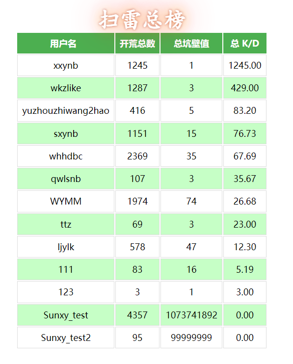

# 网页版在线多人扫雷

## 简介

这是一个小的课程设计，缺点挺多的，各位看官轻喷。

## 说明

1.我们的服务器带宽很低，所以应用的实现会采取一些不会给后端太大压力的方法。(前端人很辛苦)(指后端人经常对前端人指手画脚)

2.服务器不打算公网开放，暂定游戏账户的获取方式为：内部创建+邀请码注册。

3.网站安全性较低，也请知道网址的的用户不要通过脚本注入、sql注入或其他各种方式攻击我们。

4.大部分JavaScript代码和Css代码内置于HTML文件中，所有显示HTML文件占比很高。

## 实现方式

html+css+javascript前端 + flask后端框架 + websocket传输数据

~~flask-login文档没搞明白，就胡搞了一个身份验证逻辑~~

## 开服步骤

1. 根据databasecode.txt文件，在数据库中建好表，搞好权限(本项目没有写自动创建)。
2. 在ClearmindBase.config.py 中设置好配置信息。
3. 在main.py中设置端口号并直接运行脚本开启游戏。

## 开发人员

前端(凯爷无敌)：[Wkzlike (github.com)](https://github.com/Wkzlike)

前端(R老师是最正义的!)： [StarWYMM (github.com)](https://github.com/StarWYMM)

后端(臭鱼烂虾): [Wldcmzy (github.com)](https://github.com/Wldcmzy)

后端兼各类软件文档(什么神仙)：[xxinyux (github.com)](https://github.com/xxinyux)

## 效果图

## 可以预见的可扩展功能

​	1.数据库userInfo表中ifOnline属性设置但并未使用，后期可以改名作为“该用户是否被注销的标志位”

## 额外说明

**仅供学习使用**

**我们不接受任何捐赠**

没什么可说的乐(

