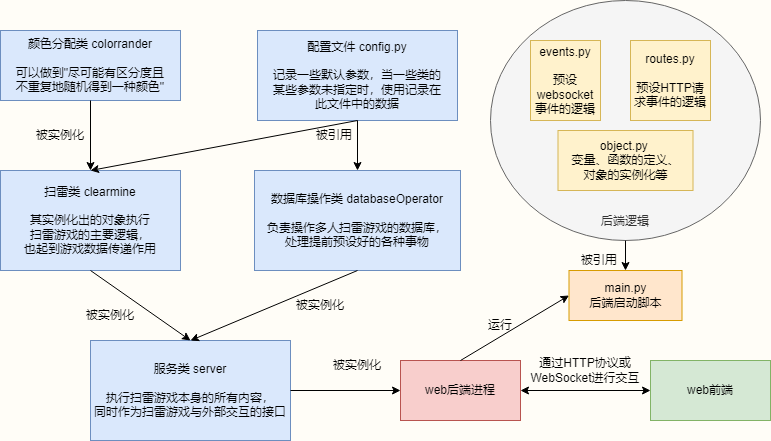
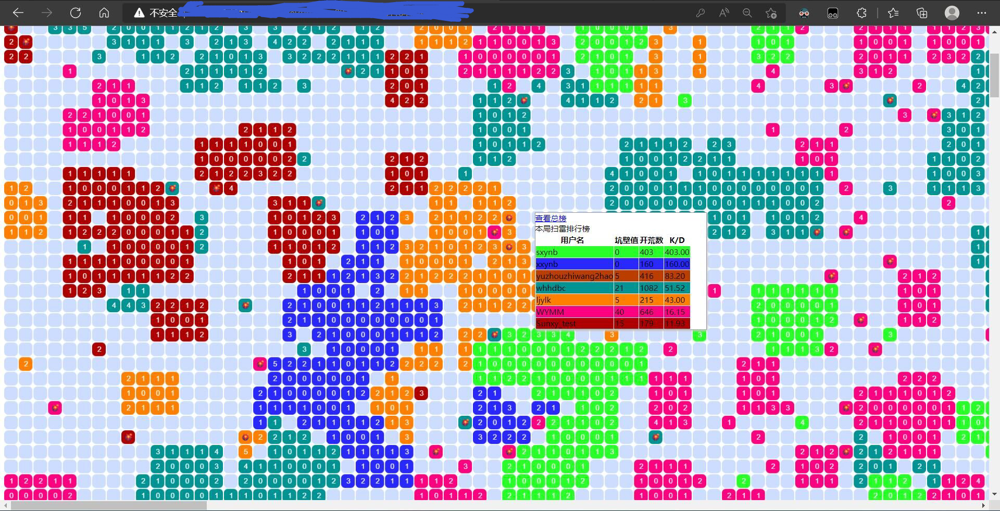
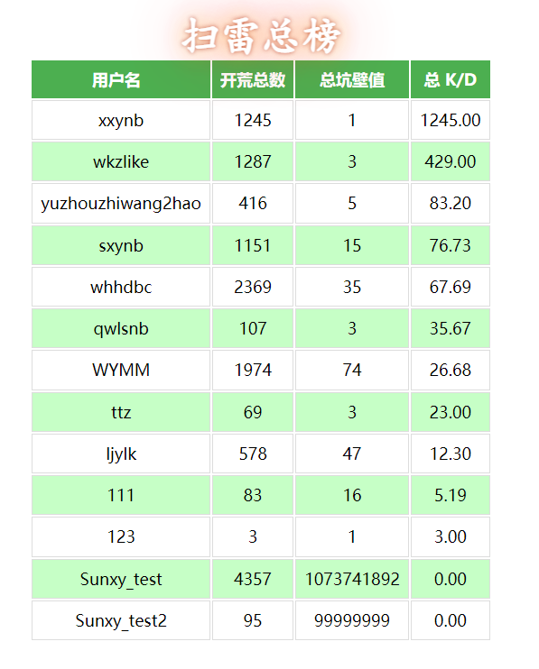

# Web Multiplayer Minesweeper

[中文](./README.md) | **English**

The writer not good at English, this document maybe difficult to understand.

## Introduction

​	A small Curriculum Design with low quality.

## Explain

1. Our ECS has low bandwidth，so we need to take method that occupy low bandwidth to achieve this game.
2. IP address of our server exposed at the public network is not we want. Player can only get an account by using Invitation code.
3. Website has low security，please don't attack us by SQL injection or any other methods.
4. HTML code takes high percentage because almost JavaScript and Css code were written at HTML file.

## Developer

​	Client：[Wkzlike (github.com)](https://github.com/Wkzlike)

​	Client： [StarWYMM (github.com)](https://github.com/StarWYMM)

​	Server: [Wldcmzy (github.com)](https://github.com/Wldcmzy)

​	Server and almost Software documentation：[xxinyux (github.com)](https://github.com/xxinyux)

## Implementation Method

html+css+javascript for client + python-flask for server + websocket for data transmission

~~Identity Authentication isn't good because of the lack of grasp of flask-login~~

## Server Structure

## Core Algorithm  Analysis

Link:[分类: 网页版多人扫雷 | 蓝湖畔淅淅沥沥的雨 (wldcmzy.github.io)](https://wldcmzy.github.io/categories/课程设计/网页版多人扫雷/)

## Steps to turn on the game server

1. Create tables and give privileges to a roll, according to file databasecode.txt (this project hasn't code to autocreate a database).
2. Set configuration at ClearmindBase/config.py
3. Set port at main.py execute it to turn on the game server.

## Game Mechanics

1. register(need invitation code), login。
2. Left key down for sweeping mine, right key down for seeing the rank of one game, there's no operation for make flag.
3. When one game finished, a pop-up-window appears, which contains the final rank of this game, and a new game start immediately. 
4. Hyperlink of total rank is found at right key menu.
5. Old Identity Authentication Code of a player will be discarded if (s)he has gone for a long time or (s)he repeat login. 

## Demonstration

## Predictable scalability

​	1.Attribute ifOnline of table userInfo is not used，which can be renamed to "cancellation" indicate if an account is canceled.

## Extra

**This project only for study**

**We don't accept any donations**

There's nothing to say(

